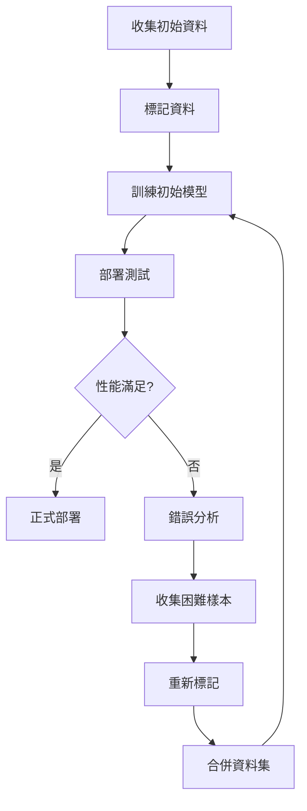

# 生產線品質管理 - 完整實作指南

本文件詳細說明如何使用 YOLOv8 進行生產線品質管理的標記、訓練與部署流程。

## 目錄

1. [專案規劃](#專案規劃)
2. [資料收集](#資料收集)
3. [資料標記](#資料標記)
4. [資料集準備](#資料集準備)
5. [模型訓練](#模型訓練)
6. [模型評估](#模型評估)
7. [模型部署](#模型部署)
8. [持續優化](#持續優化)

---

## 專案規劃

### 1. 定義檢測目標

首先明確定義要檢測的缺陷類型：

#### 範例：電子零件品質檢測

```yaml
# 定義類別
classes:
  0: good          # 良品
  1: scratch       # 刮痕
  2: dent          # 凹陷
  3: discoloration # 變色
  4: crack         # 裂痕
  5: missing_part  # 缺件
```

#### 範例：印刷電路板（PCB）檢測

```yaml
classes:
  0: normal        # 正常
  1: short         # 短路
  2: open          # 斷路
  3: spur          # 毛刺
  4: missing_hole  # 缺孔
  5: mouse_bite    # 鼠咬
  6: spurious_copper # 多餘銅箔
```

#### 範例：食品包裝檢測

```yaml
classes:
  0: qualified     # 合格品
  1: broken_seal   # 封口破損
  2: contamination # 污染
  3: underfill     # 容量不足
  4: label_defect  # 標籤缺陷
```

### 2. 評估資料需求

| 複雜度 | 每類別最少影像 | 建議影像數 | 訓練時間（GPU） |
|--------|---------------|-----------|----------------|
| 簡單（1-3 類） | 100-200 | 500+ | 1-2 小時 |
| 中等（4-6 類） | 200-500 | 1000+ | 2-4 小時 |
| 複雜（7+ 類） | 500-1000 | 2000+ | 4-8 小時 |

**建議**：
- 每個類別的樣本數量應盡量平衡
- 包含不同光線、角度、背景的樣本
- 收集邊界案例（ambiguous cases）

### 3. 硬體需求

#### 最低配置
- CPU: Intel i5 或以上
- RAM: 8GB
- 儲存空間: 20GB
- GPU: 無（可用 CPU 訓練，但較慢）

#### 建議配置
- CPU: Intel i7 或 AMD Ryzen 7
- RAM: 16GB+
- 儲存空間: 50GB+ SSD
- GPU: NVIDIA RTX 3060 (12GB VRAM) 或以上
- CUDA: 11.8 或 12.1

---

## 資料收集

### 1. 影像收集策略

#### 方法一：現場拍攝（快速品質標記）

```bash
# 使用本專案收集影像並即時標記品質
python -m src.app --source 0 --show

# 快速品質標記（按 0-9 鍵）：
# 9 = 滿分（完美良品）
# 7-8 = 良好（輕微瑕疵）
# 4-6 = 中等（明顯缺陷）
# 1-3 = 差（嚴重缺陷）
# 0 = 最差（完全不合格）

# 截圖會自動分類至：
# artifacts/screenshots/quality_0/ ~ quality_9/

# 分析收集的資料
python scripts/analyze_quality_data.py

# 建議收集：
# - 不同時間點（早、中、晚）
# - 不同光線條件
# - 不同產品位置和角度
# - 各品質等級均衡分布
```

**品質標記工作流程**：

1. **準備階段**：
   - 確認攝影機角度和光線
   - 準備不同品質的樣本
   - 開啟程式：`python -m src.app --source 0 --show`

2. **標記階段**：
   - 將產品放置在攝影機前
   - 觀察產品品質
   - 按對應數字鍵（0-9）快速截圖
   - 重複直到收集足夠樣本（建議每個等級 50-100 張）

3. **分析階段**：
   ```bash
   # 查看品質分布
   python scripts/analyze_quality_data.py

   # 匯出品質清單
   python scripts/analyze_quality_data.py --export
   ```

4. **平衡資料集**：
   - 確保各品質等級樣本數量接近
   - 如果某個等級樣本不足，繼續收集
   - 目標：每個等級 50-200 張影像

#### 方法二：從錄影檔案擷取

```python
# scripts/extract_frames.py
import cv2
from pathlib import Path

def extract_frames(video_path: str, output_dir: str, interval: int = 30):
    """
    從影片中每隔 N 幀擷取一張影像

    Args:
        video_path: 影片路徑
        output_dir: 輸出目錄
        interval: 擷取間隔（幀數）
    """
    cap = cv2.VideoCapture(video_path)
    output_path = Path(output_dir)
    output_path.mkdir(parents=True, exist_ok=True)

    frame_count = 0
    saved_count = 0

    while True:
        ret, frame = cap.read()
        if not ret:
            break

        if frame_count % interval == 0:
            filename = output_path / f"frame_{saved_count:06d}.jpg"
            cv2.imwrite(str(filename), frame)
            saved_count += 1

        frame_count += 1

    cap.release()
    print(f"提取了 {saved_count} 張影像")

if __name__ == "__main__":
    extract_frames(
        video_path="production_line.mp4",
        output_dir="data/raw_images",
        interval=30  # 每 30 幀擷取一張（約每秒一張）
    )
```

#### 方法三：資料增強

```python
# scripts/augment_data.py
import albumentations as A
import cv2
from pathlib import Path

# 定義增強策略
transform = A.Compose([
    A.HorizontalFlip(p=0.5),
    A.RandomBrightnessContrast(p=0.3),
    A.GaussNoise(p=0.2),
    A.Rotate(limit=10, p=0.3),
    A.Blur(blur_limit=3, p=0.2),
])

def augment_images(input_dir: str, output_dir: str, num_augmented: int = 3):
    """對每張影像生成 N 張增強版本"""
    input_path = Path(input_dir)
    output_path = Path(output_dir)
    output_path.mkdir(parents=True, exist_ok=True)

    for img_file in input_path.glob("*.jpg"):
        image = cv2.imread(str(img_file))
        image = cv2.cvtColor(image, cv2.COLOR_BGR2RGB)

        for i in range(num_augmented):
            augmented = transform(image=image)['image']
            augmented = cv2.cvtColor(augmented, cv2.COLOR_RGB2BGR)

            output_file = output_path / f"{img_file.stem}_aug{i}.jpg"
            cv2.imwrite(str(output_file), augmented)

    print(f"資料增強完成")
```

### 2. 影像品質要求

- **解析度**：至少 640x640 像素，建議 1280x1280
- **格式**：JPG、PNG（推薦 JPG，檔案較小）
- **光線**：明亮均勻，避免過曝或過暗
- **對焦**：清晰，無模糊
- **物件大小**：物件佔影像面積的 10-80%

---

## 資料標記

### 1. 標記工具選擇

#### 推薦：Label Studio（功能強大、易用）

**安裝**：
```bash
pip install label-studio

# 啟動
label-studio start
```

**設定檔範例**：
```xml
<View>
  <Image name="image" value="$image"/>
  <RectangleLabels name="label" toName="image">
    <Label value="good" background="green"/>
    <Label value="scratch" background="red"/>
    <Label value="dent" background="orange"/>
    <Label value="crack" background="purple"/>
    <Label value="missing_part" background="blue"/>
  </RectangleLabels>
</View>
```

訪問：http://localhost:8080

#### 推薦：Roboflow（雲端標記、自動轉換）

1. 註冊：https://roboflow.com
2. 建立專案
3. 上傳影像
4. 使用網頁介面標記
5. 匯出為 YOLO 格式

**優點**：
- 自動資料增強
- 自動分割訓練/驗證/測試集
- 團隊協作功能
- 匯出為多種格式

#### 推薦：LabelImg（本地標記、開源）

**安裝**：
```bash
pip install labelImg

# 啟動
labelImg
```

**使用步驟**：
1. Open Dir：選擇影像目錄
2. Change Save Dir：選擇標記檔案儲存目錄
3. 點擊 `PascalVOC` 切換為 `YOLO` 格式
4. 按 `W` 鍵開始繪製邊界框
5. 選擇類別
6. 按 `Ctrl+S` 儲存
7. 按 `D` 鍵切換到下一張影像

### 2. 標記最佳實踐

#### 邊界框準則

```
✅ 正確標記：
┌─────────────┐
│   ┌─────┐   │  <- 緊貼物件邊緣
│   │缺陷 │   │
│   └─────┘   │
└─────────────┘

❌ 錯誤標記：
┌─────────────┐
│  ┌───────┐  │  <- 框太大，包含過多背景
│  │ 缺陷  │  │
│  └───────┘  │
└─────────────┘

❌ 錯誤標記：
┌─────────────┐
│    ┌──┐     │  <- 框太小，未完整包含缺陷
│    │缺│     │
│    └──┘     │
└─────────────┘
```

#### 標記規範文件範例

```markdown
# 標記規範

## 1. 刮痕（scratch）
- 定義：表面可見的線性痕跡
- 最小長度：> 2mm
- 框選：緊貼刮痕兩端
- 注意：淺色刮痕也要標記

## 2. 凹陷（dent）
- 定義：表面凹陷變形
- 最小面積：> 1mm²
- 框選：包含整個凹陷區域
- 注意：區分凹陷與陰影

## 3. 裂痕（crack）
- 定義：表面裂開或斷裂
- 最小長度：> 1mm
- 框選：沿裂痕延伸方向
- 注意：與刮痕區分（裂痕有深度）

## 4. 良品（good）
- 定義：無明顯缺陷
- 標記：可選（用於訓練識別合格品）
```

### 3. 資料標記工作流程

```bash
# 步驟 1：組織原始影像
data/
├── raw_images/              # 原始影像
│   ├── batch_001/
│   ├── batch_002/
│   └── batch_003/

# 步驟 2：標記（使用 LabelImg 或 Label Studio）
# 產生標記檔案
data/
├── raw_images/              # 原始影像
└── raw_labels/              # 標記檔案（.txt）
    ├── image_001.txt
    ├── image_002.txt
    └── image_003.txt

# 步驟 3：品質檢查
python scripts/validate_labels.py --data-dir data/raw_labels
```

#### 標記品質檢查腳本

```python
# scripts/validate_labels.py
"""檢查 YOLO 標記檔案的正確性"""
from pathlib import Path
import argparse

def validate_yolo_labels(label_dir: Path, num_classes: int) -> dict:
    """
    驗證 YOLO 標記檔案格式

    Returns:
        dict: 驗證統計資訊
    """
    stats = {
        "total_files": 0,
        "valid_files": 0,
        "invalid_files": [],
        "class_distribution": {},
        "total_boxes": 0,
    }

    for label_file in label_dir.glob("*.txt"):
        stats["total_files"] += 1

        try:
            with open(label_file, "r") as f:
                lines = f.readlines()

            for line_num, line in enumerate(lines, 1):
                parts = line.strip().split()

                if len(parts) != 5:
                    raise ValueError(
                        f"Line {line_num}: Expected 5 values, got {len(parts)}"
                    )

                class_id = int(parts[0])
                x, y, w, h = map(float, parts[1:])

                # 驗證類別 ID
                if not 0 <= class_id < num_classes:
                    raise ValueError(
                        f"Line {line_num}: Invalid class_id {class_id}"
                    )

                # 驗證座標範圍
                if not all(0 <= val <= 1 for val in [x, y, w, h]):
                    raise ValueError(
                        f"Line {line_num}: Coordinates out of range [0,1]"
                    )

                # 統計
                stats["class_distribution"][class_id] = \
                    stats["class_distribution"].get(class_id, 0) + 1
                stats["total_boxes"] += 1

            stats["valid_files"] += 1

        except Exception as e:
            stats["invalid_files"].append((label_file.name, str(e)))

    return stats

def main():
    parser = argparse.ArgumentParser()
    parser.add_argument("--data-dir", required=True, help="標記檔案目錄")
    parser.add_argument("--num-classes", type=int, default=6, help="類別數量")
    args = parser.parse_args()

    label_dir = Path(args.data_dir)
    stats = validate_yolo_labels(label_dir, args.num_classes)

    print("\n=== 標記驗證報告 ===")
    print(f"總檔案數: {stats['total_files']}")
    print(f"有效檔案: {stats['valid_files']}")
    print(f"無效檔案: {len(stats['invalid_files'])}")
    print(f"總標記框數: {stats['total_boxes']}")

    print("\n類別分布:")
    for class_id, count in sorted(stats['class_distribution'].items()):
        print(f"  類別 {class_id}: {count} 個標記框")

    if stats['invalid_files']:
        print("\n無效檔案列表:")
        for filename, error in stats['invalid_files']:
            print(f"  {filename}: {error}")

    # 檢查類別不平衡
    if stats['class_distribution']:
        counts = list(stats['class_distribution'].values())
        max_count = max(counts)
        min_count = min(counts)
        if max_count / min_count > 10:
            print("\n⚠️  警告：類別嚴重不平衡！")
            print(f"   最多類別: {max_count} 個")
            print(f"   最少類別: {min_count} 個")
            print(f"   比例: {max_count/min_count:.1f}:1")

if __name__ == "__main__":
    main()
```

---

## 資料集準備

### 1. 目錄結構

```bash
data/
├── production_qc/                    # 專案資料集
│   ├── images/
│   │   ├── train/                    # 訓練集影像（70-80%）
│   │   │   ├── img_001.jpg
│   │   │   ├── img_002.jpg
│   │   │   └── ...
│   │   ├── val/                      # 驗證集影像（10-15%）
│   │   │   ├── img_501.jpg
│   │   │   └── ...
│   │   └── test/                     # 測試集影像（10-15%）
│   │       ├── img_601.jpg
│   │       └── ...
│   └── labels/
│       ├── train/                    # 訓練集標記
│       │   ├── img_001.txt
│       │   ├── img_002.txt
│       │   └── ...
│       ├── val/                      # 驗證集標記
│       │   ├── img_501.txt
│       │   └── ...
│       └── test/                     # 測試集標記
│           ├── img_601.txt
│           └── ...
└── production_qc.yaml                # 資料集配置檔
```

### 2. 建立資料集配置檔

```yaml
# data/production_qc.yaml

# 資料集根目錄
path: ../data/production_qc

# 訓練、驗證、測試集路徑（相對於 path）
train: images/train
val: images/val
test: images/test

# 類別數量
nc: 6

# 類別名稱
names:
  0: good
  1: scratch
  2: dent
  3: discoloration
  4: crack
  5: missing_part
```

### 3. 自動分割資料集腳本

```python
# scripts/split_dataset.py
"""自動分割資料集為訓練/驗證/測試集"""
import shutil
from pathlib import Path
import random
import argparse

def split_dataset(
    image_dir: Path,
    label_dir: Path,
    output_dir: Path,
    split_ratio: tuple = (0.7, 0.15, 0.15),
    seed: int = 42
):
    """
    分割資料集

    Args:
        image_dir: 影像目錄
        label_dir: 標記目錄
        output_dir: 輸出目錄
        split_ratio: (train, val, test) 比例
        seed: 隨機種子
    """
    random.seed(seed)

    # 取得所有影像檔案
    image_files = list(image_dir.glob("*.jpg")) + list(image_dir.glob("*.png"))
    random.shuffle(image_files)

    # 計算分割點
    total = len(image_files)
    train_end = int(total * split_ratio[0])
    val_end = train_end + int(total * split_ratio[1])

    # 分割
    splits = {
        "train": image_files[:train_end],
        "val": image_files[train_end:val_end],
        "test": image_files[val_end:]
    }

    # 建立目錄
    for split in ["train", "val", "test"]:
        (output_dir / "images" / split).mkdir(parents=True, exist_ok=True)
        (output_dir / "labels" / split).mkdir(parents=True, exist_ok=True)

    # 複製檔案
    for split, files in splits.items():
        print(f"\n處理 {split} 集: {len(files)} 個檔案")

        for img_file in files:
            # 複製影像
            dst_img = output_dir / "images" / split / img_file.name
            shutil.copy2(img_file, dst_img)

            # 複製標記
            label_file = label_dir / f"{img_file.stem}.txt"
            if label_file.exists():
                dst_label = output_dir / "labels" / split / label_file.name
                shutil.copy2(label_file, dst_label)
            else:
                print(f"  警告：找不到標記檔案 {label_file.name}")

    print(f"\n資料集分割完成！")
    print(f"  訓練集: {len(splits['train'])} ({split_ratio[0]*100:.0f}%)")
    print(f"  驗證集: {len(splits['val'])} ({split_ratio[1]*100:.0f}%)")
    print(f"  測試集: {len(splits['test'])} ({split_ratio[2]*100:.0f}%)")

def main():
    parser = argparse.ArgumentParser()
    parser.add_argument("--images", required=True, help="影像目錄")
    parser.add_argument("--labels", required=True, help="標記目錄")
    parser.add_argument("--output", required=True, help="輸出目錄")
    parser.add_argument("--train", type=float, default=0.7, help="訓練集比例")
    parser.add_argument("--val", type=float, default=0.15, help="驗證集比例")
    parser.add_argument("--test", type=float, default=0.15, help="測試集比例")
    args = parser.parse_args()

    split_dataset(
        image_dir=Path(args.images),
        label_dir=Path(args.labels),
        output_dir=Path(args.output),
        split_ratio=(args.train, args.val, args.test)
    )

if __name__ == "__main__":
    main()
```

**使用範例**：
```bash
python scripts/split_dataset.py \
    --images data/raw_images \
    --labels data/raw_labels \
    --output data/production_qc \
    --train 0.7 \
    --val 0.15 \
    --test 0.15
```

---

## 模型訓練

### 1. 訓練腳本

```python
# scripts/train_qc.py
"""生產線品質管理模型訓練腳本"""
from ultralytics import YOLO
import argparse
from pathlib import Path

def train_qc_model(
    data_yaml: str,
    model: str = "yolov8n.pt",
    epochs: int = 100,
    imgsz: int = 640,
    batch: int = 16,
    device: str = "0",
    patience: int = 50,
    project: str = "artifacts/runs/qc",
    name: str = "exp"
):
    """
    訓練品質管理模型

    Args:
        data_yaml: 資料集 YAML 檔案
        model: 基礎模型（yolov8n/s/m/l/x.pt）
        epochs: 訓練輪數
        imgsz: 影像大小
        batch: 批次大小
        device: GPU 設備（0, 1, 2... 或 cpu）
        patience: 早停耐心值
        project: 專案目錄
        name: 實驗名稱
    """
    print(f"\n{'='*60}")
    print(f"開始訓練品質管理模型")
    print(f"{'='*60}")
    print(f"資料集: {data_yaml}")
    print(f"基礎模型: {model}")
    print(f"訓練輪數: {epochs}")
    print(f"影像大小: {imgsz}")
    print(f"批次大小: {batch}")
    print(f"運算設備: {device}")
    print(f"{'='*60}\n")

    # 載入模型
    model = YOLO(model)

    # 訓練
    results = model.train(
        data=data_yaml,
        epochs=epochs,
        imgsz=imgsz,
        batch=batch,
        device=device,
        patience=patience,
        save=True,
        project=project,
        name=name,
        # 資料增強
        hsv_h=0.015,        # 色調增強
        hsv_s=0.7,          # 飽和度增強
        hsv_v=0.4,          # 亮度增強
        degrees=10,         # 旋轉角度
        translate=0.1,      # 平移
        scale=0.5,          # 縮放
        shear=0.0,          # 剪切
        perspective=0.0,    # 透視
        flipud=0.0,         # 上下翻轉
        fliplr=0.5,         # 左右翻轉
        mosaic=1.0,         # 馬賽克增強
        mixup=0.0,          # 混合增強
        # 優化器設定
        optimizer="auto",   # 優化器（SGD, Adam, AdamW）
        lr0=0.01,          # 初始學習率
        lrf=0.01,          # 最終學習率
        momentum=0.937,    # 動量
        weight_decay=0.0005, # 權重衰減
        warmup_epochs=3.0, # 熱身輪數
        warmup_momentum=0.8, # 熱身動量
        # 其他設定
        plots=True,        # 生成訓練圖表
        val=True,          # 驗證
        save_period=-1,    # 儲存週期（-1 表示只儲存最後）
    )

    print(f"\n{'='*60}")
    print(f"訓練完成！")
    print(f"{'='*60}")
    print(f"最佳模型: {project}/{name}/weights/best.pt")
    print(f"最終模型: {project}/{name}/weights/last.pt")
    print(f"訓練結果: {project}/{name}/results.csv")
    print(f"{'='*60}\n")

    return results

def main():
    parser = argparse.ArgumentParser(description="訓練品質管理模型")
    parser.add_argument("--data", required=True, help="資料集 YAML 檔案")
    parser.add_argument("--model", default="yolov8n.pt", help="基礎模型")
    parser.add_argument("--epochs", type=int, default=100, help="訓練輪數")
    parser.add_argument("--imgsz", type=int, default=640, help="影像大小")
    parser.add_argument("--batch", type=int, default=16, help="批次大小")
    parser.add_argument("--device", default="0", help="GPU 設備")
    parser.add_argument("--patience", type=int, default=50, help="早停耐心值")
    parser.add_argument("--project", default="artifacts/runs/qc", help="專案目錄")
    parser.add_argument("--name", default="exp", help="實驗名稱")
    args = parser.parse_args()

    train_qc_model(
        data_yaml=args.data,
        model=args.model,
        epochs=args.epochs,
        imgsz=args.imgsz,
        batch=args.batch,
        device=args.device,
        patience=args.patience,
        project=args.project,
        name=args.name,
    )

if __name__ == "__main__":
    main()
```

### 2. 訓練指令範例

#### 基本訓練（小型模型）

```bash
python scripts/train_qc.py \
    --data data/production_qc.yaml \
    --model yolov8n.pt \
    --epochs 100 \
    --imgsz 640 \
    --batch 16 \
    --device 0
```

#### 高精度訓練（大型模型）

```bash
python scripts/train_qc.py \
    --data data/production_qc.yaml \
    --model yolov8m.pt \
    --epochs 200 \
    --imgsz 1280 \
    --batch 8 \
    --device 0 \
    --patience 100
```

#### CPU 訓練（無 GPU）

```bash
python scripts/train_qc.py \
    --data data/production_qc.yaml \
    --model yolov8n.pt \
    --epochs 50 \
    --imgsz 640 \
    --batch 4 \
    --device cpu
```

### 3. 訓練參數調整建議

| 場景 | 模型 | imgsz | batch | epochs | 說明 |
|------|------|-------|-------|--------|------|
| 快速測試 | yolov8n | 640 | 16 | 50 | 驗證資料集和標記是否正確 |
| 標準訓練 | yolov8s | 640 | 16 | 100 | 平衡速度與精度 |
| 高精度 | yolov8m | 1280 | 8 | 200 | 追求最佳精度 |
| 小物件偵測 | yolov8s | 1280 | 8 | 150 | 偵測小缺陷 |
| 即時應用 | yolov8n | 640 | 16 | 100 | 速度優先 |

### 4. 監控訓練過程

訓練期間會生成多個檔案：

```
artifacts/runs/qc/exp/
├── weights/
│   ├── best.pt              # 驗證集上表現最好的模型
│   └── last.pt              # 最後一個 epoch 的模型
├── results.csv              # 訓練指標（CSV 格式）
├── results.png              # 訓練曲線圖
├── confusion_matrix.png     # 混淆矩陣
├── F1_curve.png            # F1 曲線
├── P_curve.png             # Precision 曲線
├── R_curve.png             # Recall 曲線
├── PR_curve.png            # Precision-Recall 曲線
└── labels.jpg              # 標記分布視覺化
```

**關鍵指標**：
- **mAP50**：主要評估指標（越高越好，理想 > 0.8）
- **mAP50-95**：嚴格評估指標（越高越好，理想 > 0.6）
- **Precision**：精確率（越高越好，減少誤報）
- **Recall**：召回率（越高越好，減少漏報）

---

## 模型評估

### 1. 評估腳本

```python
# scripts/evaluate_qc.py
"""評估品質管理模型"""
from ultralytics import YOLO
import argparse
from pathlib import Path

def evaluate_model(
    model_path: str,
    data_yaml: str,
    split: str = "test",
    imgsz: int = 640,
    device: str = "0"
):
    """
    評估模型性能

    Args:
        model_path: 模型路徑
        data_yaml: 資料集 YAML
        split: 評估集（test/val）
        imgsz: 影像大小
        device: 運算設備
    """
    print(f"\n{'='*60}")
    print(f"評估模型")
    print(f"{'='*60}")
    print(f"模型: {model_path}")
    print(f"資料集: {data_yaml}")
    print(f"評估集: {split}")
    print(f"{'='*60}\n")

    # 載入模型
    model = YOLO(model_path)

    # 評估
    results = model.val(
        data=data_yaml,
        split=split,
        imgsz=imgsz,
        device=device,
        plots=True,
    )

    # 顯示結果
    print(f"\n{'='*60}")
    print(f"評估結果")
    print(f"{'='*60}")
    print(f"mAP50: {results.box.map50:.4f}")
    print(f"mAP50-95: {results.box.map:.4f}")
    print(f"Precision: {results.box.mp:.4f}")
    print(f"Recall: {results.box.mr:.4f}")
    print(f"{'='*60}\n")

    # 每個類別的性能
    print("各類別性能:")
    for i, name in enumerate(results.names.values()):
        print(f"  {name:15s}: "
              f"P={results.box.class_result(i)[0]:.3f}, "
              f"R={results.box.class_result(i)[1]:.3f}, "
              f"mAP50={results.box.class_result(i)[2]:.3f}")

    return results

def main():
    parser = argparse.ArgumentParser()
    parser.add_argument("--model", required=True, help="模型路徑")
    parser.add_argument("--data", required=True, help="資料集 YAML")
    parser.add_argument("--split", default="test", help="評估集")
    parser.add_argument("--imgsz", type=int, default=640, help="影像大小")
    parser.add_argument("--device", default="0", help="運算設備")
    args = parser.parse_args()

    evaluate_model(
        model_path=args.model,
        data_yaml=args.data,
        split=args.split,
        imgsz=args.imgsz,
        device=args.device,
    )

if __name__ == "__main__":
    main()
```

**使用範例**：
```bash
python scripts/evaluate_qc.py \
    --model artifacts/runs/qc/exp/weights/best.pt \
    --data data/production_qc.yaml \
    --split test
```

### 2. 視覺化預測結果

```python
# scripts/visualize_predictions.py
"""視覺化模型預測結果"""
from ultralytics import YOLO
import cv2
from pathlib import Path
import argparse

def visualize_predictions(
    model_path: str,
    image_dir: str,
    output_dir: str,
    conf: float = 0.25,
    max_images: int = 20
):
    """
    視覺化預測結果

    Args:
        model_path: 模型路徑
        image_dir: 影像目錄
        output_dir: 輸出目錄
        conf: 信心度閾值
        max_images: 最多處理幾張影像
    """
    model = YOLO(model_path)
    image_path = Path(image_dir)
    output_path = Path(output_dir)
    output_path.mkdir(parents=True, exist_ok=True)

    image_files = list(image_path.glob("*.jpg"))[:max_images]

    for img_file in image_files:
        # 預測
        results = model.predict(
            source=str(img_file),
            conf=conf,
            save=False,
        )

        # 繪製結果
        annotated = results[0].plot()

        # 儲存
        output_file = output_path / f"pred_{img_file.name}"
        cv2.imwrite(str(output_file), annotated)

        print(f"處理: {img_file.name} -> {output_file}")

    print(f"\n完成！結果儲存於: {output_dir}")

def main():
    parser = argparse.ArgumentParser()
    parser.add_argument("--model", required=True, help="模型路徑")
    parser.add_argument("--images", required=True, help="影像目錄")
    parser.add_argument("--output", default="artifacts/predictions", help="輸出目錄")
    parser.add_argument("--conf", type=float, default=0.25, help="信心度閾值")
    parser.add_argument("--max", type=int, default=20, help="最多處理幾張")
    args = parser.parse_args()

    visualize_predictions(
        model_path=args.model,
        image_dir=args.images,
        output_dir=args.output,
        conf=args.conf,
        max_images=args.max,
    )

if __name__ == "__main__":
    main()
```

**使用範例**：
```bash
python scripts/visualize_predictions.py \
    --model artifacts/runs/qc/exp/weights/best.pt \
    --images data/production_qc/images/test \
    --output artifacts/predictions \
    --conf 0.5
```

---

## 模型部署

### 1. 即時偵測部署

```bash
# 使用訓練好的模型進行即時偵測
python -m src.app \
    --source 0 \
    --model artifacts/runs/qc/exp/weights/best.pt \
    --conf 0.5 \
    --device cuda \
    --show
```

### 2. 部署腳本（含報警功能）

```python
# scripts/deploy_qc.py
"""生產線品質管理部署腳本"""
from ultralytics import YOLO
import cv2
import time
from datetime import datetime
from pathlib import Path
import argparse

class QualityControl:
    """品質管理系統"""

    def __init__(
        self,
        model_path: str,
        source: str = "0",
        conf: float = 0.5,
        save_defects: bool = True,
        output_dir: str = "artifacts/qc_results"
    ):
        self.model = YOLO(model_path)
        self.source = source
        self.conf = conf
        self.save_defects = save_defects
        self.output_dir = Path(output_dir)
        self.output_dir.mkdir(parents=True, exist_ok=True)

        # 統計
        self.stats = {
            "total": 0,
            "good": 0,
            "defects": {},
        }

    def run(self):
        """執行品質管理"""
        cap = cv2.VideoCapture(self.source if self.source.isdigit()
                              else int(self.source))

        if not cap.isOpened():
            raise RuntimeError(f"無法開啟影像來源: {self.source}")

        print("品質管理系統啟動")
        print("按 'q' 退出")

        while True:
            ret, frame = cap.read()
            if not ret:
                break

            # 預測
            results = self.model.predict(
                source=frame,
                conf=self.conf,
                verbose=False,
            )

            # 分析結果
            has_defect = False
            defect_types = []

            for r in results:
                boxes = r.boxes
                if boxes is not None and len(boxes) > 0:
                    for box in boxes:
                        cls = int(box.cls[0])
                        class_name = r.names[cls]

                        if class_name != "good":
                            has_defect = True
                            defect_types.append(class_name)

                            # 更新統計
                            if class_name not in self.stats["defects"]:
                                self.stats["defects"][class_name] = 0
                            self.stats["defects"][class_name] += 1

            # 更新統計
            self.stats["total"] += 1
            if not has_defect:
                self.stats["good"] += 1

            # 儲存缺陷影像
            if has_defect and self.save_defects:
                timestamp = datetime.now().strftime("%Y%m%d_%H%M%S_%f")
                defect_str = "_".join(defect_types)
                filename = f"defect_{timestamp}_{defect_str}.jpg"
                filepath = self.output_dir / filename
                cv2.imwrite(str(filepath), frame)
                print(f"⚠️  偵測到缺陷: {defect_types} -> {filename}")

            # 繪製結果
            annotated = results[0].plot()

            # 顯示統計
            cv2.putText(
                annotated,
                f"Total: {self.stats['total']} | Good: {self.stats['good']} | "
                f"Defect: {self.stats['total'] - self.stats['good']}",
                (10, 30),
                cv2.FONT_HERSHEY_SIMPLEX,
                0.7,
                (0, 255, 0),
                2
            )

            # 顯示
            cv2.imshow("Quality Control", annotated)

            # 按鍵處理
            key = cv2.waitKey(1) & 0xFF
            if key == ord('q'):
                break

        cap.release()
        cv2.destroyAllWindows()

        # 顯示最終統計
        self.print_stats()

    def print_stats(self):
        """顯示統計資訊"""
        print("\n" + "="*60)
        print("品質管理統計")
        print("="*60)
        print(f"總檢測數: {self.stats['total']}")
        print(f"良品數: {self.stats['good']} "
              f"({self.stats['good']/self.stats['total']*100:.1f}%)")
        print(f"缺陷數: {self.stats['total'] - self.stats['good']} "
              f"({(self.stats['total']-self.stats['good'])/self.stats['total']*100:.1f}%)")

        if self.stats['defects']:
            print("\n缺陷類型分布:")
            for defect, count in sorted(
                self.stats['defects'].items(),
                key=lambda x: x[1],
                reverse=True
            ):
                print(f"  {defect:15s}: {count:4d} "
                      f"({count/self.stats['total']*100:.1f}%)")

        print("="*60)

def main():
    parser = argparse.ArgumentParser()
    parser.add_argument("--model", required=True, help="模型路徑")
    parser.add_argument("--source", default="0", help="影像來源")
    parser.add_argument("--conf", type=float, default=0.5, help="信心度閾值")
    parser.add_argument("--save", action="store_true", help="儲存缺陷影像")
    parser.add_argument("--output", default="artifacts/qc_results", help="輸出目錄")
    args = parser.parse_args()

    qc = QualityControl(
        model_path=args.model,
        source=args.source,
        conf=args.conf,
        save_defects=args.save,
        output_dir=args.output,
    )
    qc.run()

if __name__ == "__main__":
    main()
```

**使用範例**：
```bash
# 即時品質檢測（儲存缺陷影像）
python scripts/deploy_qc.py \
    --model artifacts/runs/qc/exp/weights/best.pt \
    --source 0 \
    --conf 0.5 \
    --save

# 處理 RTSP 串流
python scripts/deploy_qc.py \
    --model artifacts/runs/qc/exp/weights/best.pt \
    --source rtsp://192.168.1.100:554/stream \
    --conf 0.6 \
    --save
```

### 3. 模型匯出（加速推論）

```python
# scripts/export_qc_model.py
"""匯出模型為不同格式"""
from ultralytics import YOLO
import argparse

def export_model(model_path: str, format: str = "onnx"):
    """
    匯出模型

    Args:
        model_path: 模型路徑
        format: 匯出格式（onnx, torchscript, openvino, tensorrt）
    """
    model = YOLO(model_path)

    print(f"匯出模型為 {format.upper()} 格式...")
    exported_path = model.export(format=format)

    print(f"匯出完成: {exported_path}")
    return exported_path

def main():
    parser = argparse.ArgumentParser()
    parser.add_argument("--model", required=True, help="模型路徑")
    parser.add_argument("--format", default="onnx",
                       choices=["onnx", "torchscript", "openvino", "tensorrt"],
                       help="匯出格式")
    args = parser.parse_args()

    export_model(args.model, args.format)

if __name__ == "__main__":
    main()
```

**匯出範例**：
```bash
# 匯出為 ONNX（跨平台）
python scripts/export_qc_model.py \
    --model artifacts/runs/qc/exp/weights/best.pt \
    --format onnx

# 匯出為 TensorRT（NVIDIA GPU 最快）
python scripts/export_qc_model.py \
    --model artifacts/runs/qc/exp/weights/best.pt \
    --format tensorrt
```

---

## 持續優化

### 1. 錯誤分析

```python
# scripts/analyze_errors.py
"""分析模型預測錯誤"""
from ultralytics import YOLO
from pathlib import Path
import cv2
import numpy as np

def analyze_errors(
    model_path: str,
    test_images: str,
    test_labels: str,
    output_dir: str = "artifacts/error_analysis"
):
    """分析預測錯誤"""
    model = YOLO(model_path)
    output_path = Path(output_dir)
    output_path.mkdir(parents=True, exist_ok=True)

    errors = {
        "false_positive": [],  # 誤報
        "false_negative": [],  # 漏報
        "wrong_class": [],     # 分類錯誤
    }

    image_dir = Path(test_images)
    label_dir = Path(test_labels)

    for img_file in image_dir.glob("*.jpg"):
        # 讀取真實標記
        label_file = label_dir / f"{img_file.stem}.txt"
        if not label_file.exists():
            continue

        with open(label_file, "r") as f:
            gt_boxes = [line.strip().split() for line in f]

        # 預測
        results = model.predict(source=str(img_file), conf=0.25, verbose=False)
        pred_boxes = results[0].boxes

        # 比較（簡化版，實際需要 IoU 計算）
        if pred_boxes is None or len(pred_boxes) == 0:
            if len(gt_boxes) > 0:
                errors["false_negative"].append(img_file)
        else:
            if len(pred_boxes) > len(gt_boxes):
                errors["false_positive"].append(img_file)

    # 輸出報告
    print("\n錯誤分析報告")
    print("="*60)
    print(f"誤報（False Positive）: {len(errors['false_positive'])} 張")
    print(f"漏報（False Negative）: {len(errors['false_negative'])} 張")
    print(f"分類錯誤: {len(errors['wrong_class'])} 張")
    print("="*60)

    # 儲存錯誤影像清單
    for error_type, files in errors.items():
        if files:
            list_file = output_path / f"{error_type}.txt"
            with open(list_file, "w") as f:
                for file in files:
                    f.write(f"{file}\n")
            print(f"{error_type} 清單: {list_file}")

if __name__ == "__main__":
    import argparse
    parser = argparse.ArgumentParser()
    parser.add_argument("--model", required=True)
    parser.add_argument("--images", required=True)
    parser.add_argument("--labels", required=True)
    args = parser.parse_args()

    analyze_errors(args.model, args.images, args.labels)
```

### 2. 主動學習（收集困難樣本）

```python
# scripts/active_learning.py
"""主動學習：找出模型不確定的樣本"""
from ultralytics import YOLO
from pathlib import Path
import shutil

def find_uncertain_samples(
    model_path: str,
    image_dir: str,
    output_dir: str = "data/uncertain_samples",
    conf_threshold: float = 0.4,
    max_samples: int = 100
):
    """
    找出模型預測不確定的樣本

    低信心度預測表示模型不確定，這些樣本值得重新標記和訓練
    """
    model = YOLO(model_path)
    output_path = Path(output_dir)
    output_path.mkdir(parents=True, exist_ok=True)

    uncertain_samples = []

    for img_file in Path(image_dir).glob("*.jpg"):
        results = model.predict(source=str(img_file), conf=0.1, verbose=False)
        boxes = results[0].boxes

        if boxes is not None and len(boxes) > 0:
            # 找最高信心度
            max_conf = float(boxes.conf.max())

            # 如果最高信心度 < 閾值，表示不確定
            if max_conf < conf_threshold:
                uncertain_samples.append((img_file, max_conf))

    # 排序（信心度由低到高）
    uncertain_samples.sort(key=lambda x: x[1])

    # 複製前 N 個最不確定的樣本
    for img_file, conf in uncertain_samples[:max_samples]:
        dst = output_path / img_file.name
        shutil.copy2(img_file, dst)
        print(f"{img_file.name}: conf={conf:.3f}")

    print(f"\n找到 {len(uncertain_samples)} 個不確定樣本")
    print(f"已複製前 {min(len(uncertain_samples), max_samples)} 個至 {output_dir}")
    print("建議重新標記這些影像並加入訓練集")

if __name__ == "__main__":
    import argparse
    parser = argparse.ArgumentParser()
    parser.add_argument("--model", required=True)
    parser.add_argument("--images", required=True)
    parser.add_argument("--output", default="data/uncertain_samples")
    parser.add_argument("--threshold", type=float, default=0.4)
    parser.add_argument("--max", type=int, default=100)
    args = parser.parse_args()

    find_uncertain_samples(
        args.model,
        args.images,
        args.output,
        args.threshold,
        args.max
    )
```

### 3. 迭代訓練流程



---

## 完整工作流程範例

### 第一次訓練

```bash
# 1. 準備資料集
python scripts/split_dataset.py \
    --images data/raw_images \
    --labels data/raw_labels \
    --output data/production_qc

# 2. 驗證標記
python scripts/validate_labels.py \
    --data-dir data/production_qc/labels/train \
    --num-classes 6

# 3. 訓練模型
python scripts/train_qc.py \
    --data data/production_qc.yaml \
    --model yolov8s.pt \
    --epochs 100 \
    --name qc_v1

# 4. 評估模型
python scripts/evaluate_qc.py \
    --model artifacts/runs/qc/qc_v1/weights/best.pt \
    --data data/production_qc.yaml

# 5. 視覺化預測
python scripts/visualize_predictions.py \
    --model artifacts/runs/qc/qc_v1/weights/best.pt \
    --images data/production_qc/images/test

# 6. 部署測試
python scripts/deploy_qc.py \
    --model artifacts/runs/qc/qc_v1/weights/best.pt \
    --source 0 \
    --save
```

### 迭代改進

```bash
# 1. 錯誤分析
python scripts/analyze_errors.py \
    --model artifacts/runs/qc/qc_v1/weights/best.pt \
    --images data/production_qc/images/test \
    --labels data/production_qc/labels/test

# 2. 收集不確定樣本
python scripts/active_learning.py \
    --model artifacts/runs/qc/qc_v1/weights/best.pt \
    --images data/production_new_samples \
    --output data/uncertain_samples

# 3. 重新標記（使用 LabelImg）
labelImg data/uncertain_samples

# 4. 合併新資料到訓練集
cp data/uncertain_samples/*.jpg data/production_qc/images/train/
cp data/uncertain_samples/*.txt data/production_qc/labels/train/

# 5. 重新訓練
python scripts/train_qc.py \
    --data data/production_qc.yaml \
    --model artifacts/runs/qc/qc_v1/weights/best.pt \
    --epochs 50 \
    --name qc_v2
```

---

## 常見問題與解決方案

### Q1: 模型過擬合（訓練集好但驗證集差）

**症狀**：訓練集 mAP > 0.9，但驗證集 mAP < 0.6

**解決方案**：
1. 增加訓練資料量
2. 增強資料增強（增加 `hsv_h`, `degrees`, `scale` 參數）
3. 使用 Dropout（較大模型自帶）
4. 減少訓練輪數（使用 early stopping）

### Q2: 模型欠擬合（訓練集也不好）

**症狀**：訓練集和驗證集 mAP 都 < 0.5

**解決方案**：
1. 使用更大的模型（yolov8m 或 yolov8l）
2. 增加訓練輪數
3. 增加影像解析度（imgsz=1280）
4. 檢查標記品質

### Q3: 小物件偵測不佳

**解決方案**：
1. 增加影像解析度（imgsz=1280）
2. 使用 mosaic 增強
3. 調整 anchor 大小
4. 收集更多小物件樣本

### Q4: 類別不平衡

**症狀**：某些類別 Recall 很低

**解決方案**：
1. 平衡各類別樣本數
2. 使用資料增強增加少數類別
3. 調整類別權重（需修改訓練程式碼）

### Q5: 即時性不足

**解決方案**：
1. 使用 yolov8n（最快）
2. 降低解析度（imgsz=640）
3. 使用 TensorRT 加速
4. 使用更好的 GPU

---

## 總結與建議

### 資料品質最重要

- ✅ 標記品質 > 資料數量
- ✅ 多樣性（不同光線、角度、位置）
- ✅ 平衡各類別樣本數
- ✅ 定期檢查標記錯誤

### 訓練策略

- ✅ 從小模型開始快速驗證
- ✅ 使用預訓練模型（transfer learning）
- ✅ 監控 val 指標，避免過擬合
- ✅ 保存每次訓練的配置和結果

### 部署建議

- ✅ 在真實環境中測試
- ✅ 收集邊界案例持續改進
- ✅ 監控誤報率和漏報率
- ✅ 建立人工複查機制

### 性能指標建議

| 應用場景 | mAP50 目標 | Precision 目標 | Recall 目標 |
|---------|-----------|---------------|------------|
| 初步篩選 | > 0.6 | > 0.7 | > 0.8 |
| 標準品檢 | > 0.8 | > 0.85 | > 0.85 |
| 嚴格品檢 | > 0.9 | > 0.9 | > 0.9 |

---

## 相關資源

- [Ultralytics YOLOv8 文件](https://docs.ultralytics.com/)
- [Roboflow 教學](https://roboflow.com/tutorials)
- [Label Studio 文件](https://labelstud.io/guide/)
- [本專案 README.md](README.md)
- [本專案 DEVELOP.md](DEVELOP.md)
